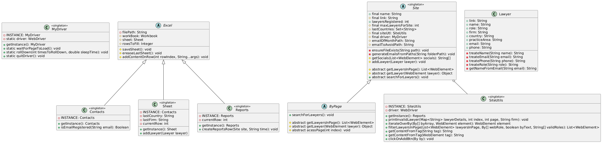

<!-- TOC -->
* [Ideas](#ideas)
* [Useful Commentaries](#useful-commentaries)
* [Check](#check)
<!-- TOC -->

---
GIT COMMANDs:
git add . ':!data/sites'
git add . ':!data/sites' ':!src/main/java/org/example/src/entities/MyDriver.java'

---
# Ideas
1. todo:
   1. maybe add a PROXY in `makeValidations` to identify why the validation failed
      1. Or even create a Error class to throw specific errors
2. 

---
# Useful Commentaries
* Efficiency option of shuffling lists of completed elements

* UML Diagram

---

- Last time clearing `weekFirms.txt` == 22/07/25

  **Clean it in 2 and 2 months**

